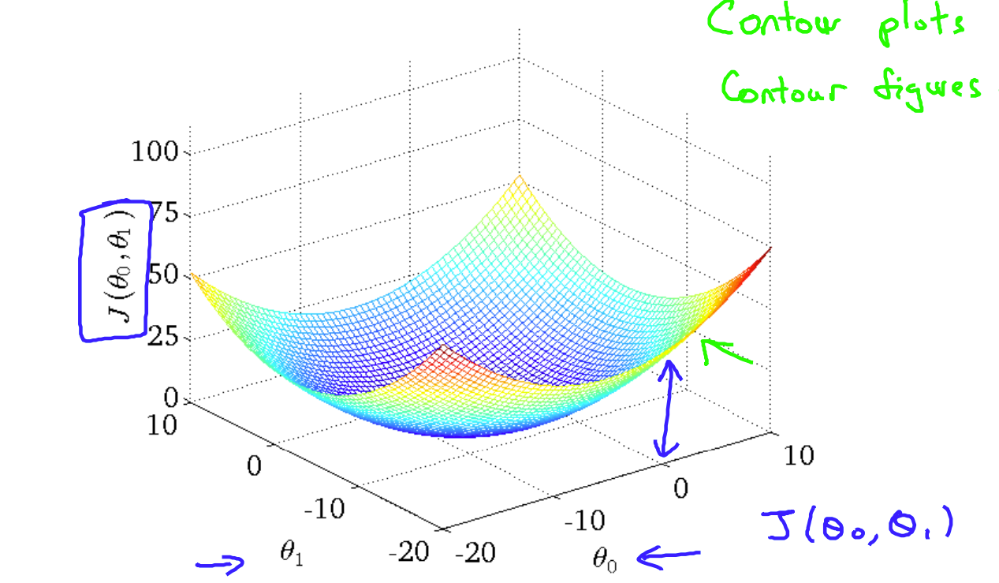
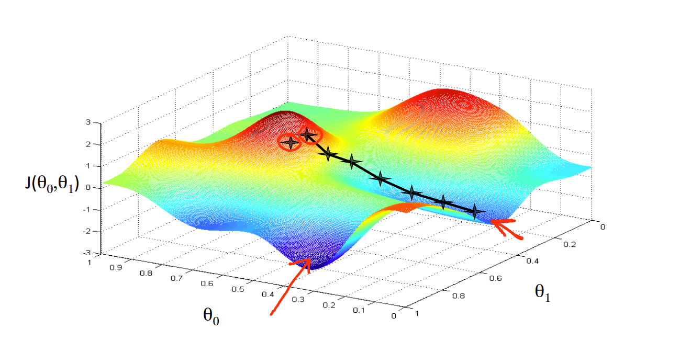
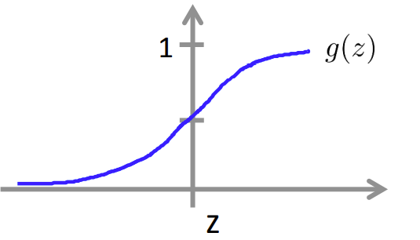
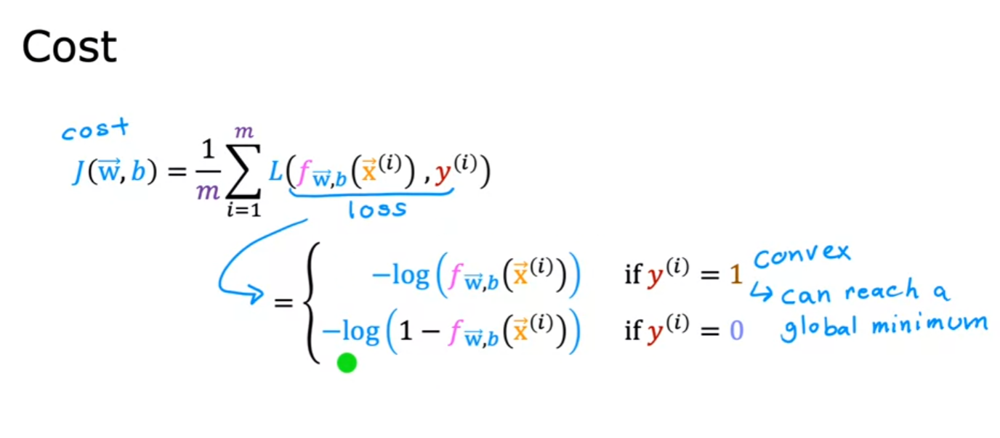

## Week 1

##### Supervised Learning
In supervised learning, we are given a data set and already know what our correct output should look like so there is a relationship between the input and the output.       

Supervised learning problems are categorized into "regression" and "classification" problems.
*  In a regression problem, we are trying to predict results within a continuous output, meaning that we are trying to map input variables to some continuous function.
* In a classification problem, we are instead trying to predict results in a discrete output. In other words, we are trying to map input variables into discrete categories.

#### Unsupervised learning    
Unsupervised learning, on the other hand, allows us to approach problems with little or no idea what our results should look like.

#### Notation
* $x:$ "input" variable or a "feature"
* $y:$ "output" variable or a "target" variable
* $m:$ number of training example
* $f:$ model
* $\hat{y}:$ prediction of the model

#### Linear regression
* $f(x) = wx+b$
* A line is used to fit the input and output relations.

#### Cost function
$J(w, b)= \frac{1}{2m}\sum_{i=1}^m (\hat{y^{(i)}} - y^{(i)})^2$ 
The division by 2 in the $\frac{1}{2m}$ is just to make calculations cleaner
Our goal is to $\text{minimize } J(w, b)$

<!--  -->

#### Gradient descent
   

We change the parameters $w,  b$  by going along the steepest gradient downwards in the cost function. 
* $w = w -\alpha \frac{\partial{J(w,b)}}{\partial{w}}$
* $b = b - \alpha  \frac{\partial{J(w,b)}}{\partial{b}}$

$\alpha$ is called learning rate.
* If the learning rate is too small gradient descent will be slow.
* If the learning rate is large gradient descent may overshoot and fail to converge.

##### Correct way to implement gradient descent
$tmp_w = w - \alpha \frac{\partial{J(w,b)}}{\partial{w}}$
$tmp_b =b - \alpha  \frac{\partial{J(w,b)}}{\partial{b}}$
$w = tmp_w$
$b = tmp_b$

##### Derivatives for the squared error cost function
$\frac{\partial{J(w,b)}}{\partial w} = \frac{1}{m}\sum_{i=1}^m(f_{w,b}(x^{(i)}) - y^{(i)})x^{(i)}$
$\frac{\partial{J(w,b)}}{\partial b} = \frac{1}{m}\sum_{i=1}^m(f_{w,b}(x^{(i)}) - y^{(i)})$

## Week 2

#### Multiple features

* $x_j: j^{th} \text{feature}$
* $n = \text{}$ number of features
* $\boldsymbol{x^{i}}:$ features of $i^{th}$training example 
* $\boldsymbol{x_j^{i}}:$ value of $j^{th}$ feature in $i^{th}$ training example

With multiple features, the model will be:
$f_{w,b}(x)= w_1x_1+w_2x_2 +w_3x_3+ ... +w_nx_n +b$

let $\boldsymbol{w} = [w_1, w_2, w_3, ... , w_n]$
and $\boldsymbol{x} = [x_1, x_2,x_3,...,x_n]$

then, $f_{w,b}(x) =\boldsymbol{w\cdot x} +b$

### Feature Scaling
Scaling features so that different features of same object range between a fixed value so that the features are comparable can make gradient descent work much better.

Example: feature $x_1$ ranges from 10 to 300 and $x_2$ ranges from 0 to 5.

##### Dividing by MAX
$x_1=\frac{x_1}{MAX(x_1)}$ --> now it ranges from 0.3 to 1
$x_2 = \frac{x_2}{MAX(x_2)}$ --> now it ranges from 0 to 1

#####  Mean NORMALISATION 
- Centred around 0
- $x_n = \frac{x_n - \mu_n}{MAX(x_n) - MIN(x_n)}$ where $\mu$ is the mean

##### Z-shape normalisation
- Calculate $\sigma$ and $\mu$ which is the standard deviation and mean respectively
- $x_n = \frac{x_n-\mu_n}{\sigma_n}$
- Gives us a Normal Distribution     

## Week 3

####  Logistic Regression
#####  SIGMOID function

- $g(z) = \frac{1}{1+e^{-z}}$ 

- $f(\boldsymbol{x}) = g(\boldsymbol{w}\cdot \boldsymbol{x} + b)$
- Decision boundary: $z = \boldsymbol{w \cdot x} + b=0$

#### Cost function and loss function

   

$L(f_{\boldsymbol{w},b}(\boldsymbol{x^{(i)}}), y^{(i)}) = -y^{(i)}log(f_{\boldsymbol{w},b}(\boldsymbol{x^{(i)}})) -(1-y^{(i)})log(1-f_{\boldsymbol{w},b}(\boldsymbol{x^{(i)}}))$

$J(\boldsymbol w, b) = \frac{1}{m} \sum _{i=1}^m[L(f_{\boldsymbol{w},b}(\boldsymbol{x^{(i)}}), y^{(i)})]$

